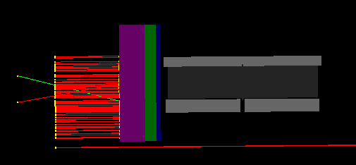
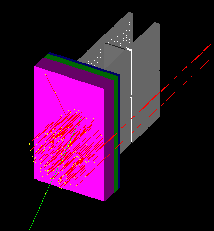

---
jupyter:
  jupytext:
    text_representation:
      extension: .Rmd
      format_name: rmarkdown
      format_version: '1.2'
      jupytext_version: 1.5.2
  kernelspec:
    display_name: Python [conda env:py3] *
    language: python
    name: conda-env-py3-py
---

<!-- #region -->
# GSFC Electron Beam Flux and Energy Calculation

Let the nominal background noise on the detector be $N_{BG} = 20$ counts/s-det (to be refined with control data taken inside GSFC vacuum chamber), and the maximum detector count rate is $C_{max}$.

The Redlen M1770 CZT photon energy range is 50 - 300 keV. We will assume that electrons are less efficient at energy deposition than photons, such that we're interested in looking at electron final energies of 50 - 500 keV.

We would like a minimum number of electrons/bin to be approximately 10x as high as the background for sufficient statistics in each energy bin. This is the low end constraint. The upper end constraint is the maximum AXIS detector count rate, $C_{max}$.

The minimum intensity the REF electron generator can achieve is

$$I_{min} = 10^{-9} ~mA/cm^2 = 6 \times 10^6 ~e^-/s/cm^2$$

over the energy ranges of 35 keV - 1.7 MeV. The beam is simulated passing through the shielding and depositing in the Redlen detectors in GEANT4. The simulated shielding electron flux attenuation response to a monoenergetic beam is  
   
$$\frac{I}{I_0} = m ~E + b$$

$$m = 8\times10^{-4}~keV^{-1} ~~,~~ b = -0.725$$


where $E$ is the electron beam energy in units of keV. Typical $I/I_0$ values are $8.9\times10^{-4} - 7.0\times10^{-3}$ for energies of 1000 - 1700 keV. We aim to receive data in the following window:

$$Range = [10 \cdot N_{BG}~,~ C_{max}] \approx [200, 80000]~cps$$

<!-- #endregion -->


 


```{python}
# %matplotlib inline

import matplotlib.pyplot as plt
import numpy as np
import pandas as pd
```

```{python}
# Connor's testing results for the average maximum count rate for one detector, 
# using 4 sources directly on the detector
intPeriod  = [0.25, 0.5, 0.75, 1, 2, 3, 4, 5, 6, 7, 8, 9, 10]; # [seconds]
avgCntRate = [15200,60550,76000,83550,94850, 99192,101706,103250,104354,105114,105713,106167,106495]; # [cps]
plt.figure(figsize=(8,5)); plt.grid(); plt.plot(intPeriod, avgCntRate, '.-');
plt.xlabel('Integration Period [s]', fontsize=14); plt.title("One Module Saturation Test",fontsize=14);
plt.ylabel('Maximum Count Rate\n at 100% Saturation [cps]', fontsize=14);
plt.hlines(xmin=0, xmax=10, y=60000, linestyle='--', label='Redlen Quoted Max Count Rate'); plt.legend();
```

```{python}
def readInFrames2Dictionary(extension):
    # "energy in keV": pandas dataframe
    return {"1000": pd.read_csv("../data/resultsFile_GSFCtest_1000keV_" + str(extension) + ".csv", 
                                 names=['E','det','i','j','x0','y0','z0']),
             "1100": pd.read_csv("../data/resultsFile_GSFCtest_1100keV_" + str(extension) + ".csv", 
                                 names=['E','det','i','j','x0','y0','z0']),
             "1200": pd.read_csv("../data/resultsFile_GSFCtest_1200keV_" + str(extension) + ".csv", 
                                 names=['E','det','i','j','x0','y0','z0']),
             "1300": pd.read_csv("../data/resultsFile_GSFCtest_1300keV_" + str(extension) + ".csv", 
                                 names=['E','det','i','j','x0','y0','z0']),
             "1400": pd.read_csv("../data/resultsFile_GSFCtest_1400keV_" + str(extension) + ".csv", 
                                 names=['E','det','i','j','x0','y0','z0']),
             "1500": pd.read_csv("../data/resultsFile_GSFCtest_1500keV_" + str(extension) + ".csv", 
                                 names=['E','det','i','j','x0','y0','z0']),
             "1600": pd.read_csv("../data/resultsFile_GSFCtest_1600keV_" + str(extension) + ".csv", 
                                 names=['E','det','i','j','x0','y0','z0']),
             "1700": pd.read_csv("../data/resultsFile_GSFCtest_1700keV_" + str(extension) + ".csv", 
                                 names=['E','det','i','j','x0','y0','z0'])}

def plotTestSpectra(frame, bins, nSimParts, plotOn):
    
    penetratingFraction = [];
    
    for name in frame.keys():
        if plotOn is True:
            plt.figure(figsize=(14,3)); plt.subplot(1,2,1); plt.grid();
            plt.hist(frame[name].E, bins=50);
            plt.xlabel("Energy [keV]"); plt.ylabel("Counts");
            plt.title(r"E$_0$ = %s keV, total counts: %i" % (name, len(frame[name])));

            plt.subplot(1,2,2); plt.grid();
            plt.hist(frame[name].E, bins=bins);
            plt.title("AXIS Bins");
            plt.xlabel("Energy [keV]"); plt.ylabel("Counts");

        penetratingFraction.append(len(frame[name])/nSimParts);

        print("E0 = %s keV %.3f%% electrons through shielding" % (name, 100*len(frame[name])/nSimParts))

    print();
    return penetratingFraction;

GSFC_data_2mm  = readInFrames2Dictionary("LR2"); # 2 mm aluminum
GSFC_data_LR   = readInFrames2Dictionary("LR");  # no aluminum, long run simulation
GSFC_data_1mm  = readInFrames2Dictionary("1mm"); # 1 mm aluminum
nSimulation    = 1e6;  # typical simulation
nSimulation_LR = 1e8;  # long run simulation
```

```{python}
bins = np.logspace(np.log10(50), np.log10(500), 20);
bins = np.insert(bins, 0, 0);            # underflow
#bins = np.insert(bins, len(bins), 1500); # overflow

print("No aluminum")
# no aluminum
penFrac_LR = plotTestSpectra(GSFC_data_LR, bins, 1e8, False);

print("1 mm aluminum")
# 1 mm aluminum
penFrac_1mm = plotTestSpectra(GSFC_data_1mm, bins, 1e6, False);

print("2 mm aluminum")
# 2 mm aluminum
penFrac_2mm = plotTestSpectra(GSFC_data_2mm, bins, 1e6, False);
```

```{python}
I                 = 6e6; # electrons/cm^2-sec
integrationPeriod = 1;   # sec

# hand-fit coefficients
m = 0.0008;
b = -0.725;

energyArray = [1000, 1100, 1200, 1300, 1400, 1500, 1600, 1700]; # keV

plt.figure(figsize=(14,5)); plt.subplot(1,2,1); plt.grid();
plt.plot(energyArray[0:-1], np.multiply(penFrac_LR[0:-1], 100), '.', label='no Al');
plt.xlabel("Beam Energy [keV]", fontsize=12);
plt.ylabel("Beam Flux Penetration [%]", fontsize=12);
plt.plot(energyArray, np.multiply(energyArray,m) + b, label='Linear Fit');
plt.legend();

plt.subplot(1,2,2); plt.grid();
plt.plot(energyArray, np.multiply(penFrac_1mm, I*integrationPeriod), '.', label='1 mm Al');
plt.plot(energyArray, np.multiply(penFrac_2mm, I*integrationPeriod), '.', label='2 mm Al');
plt.plot(energyArray[0:-1], np.multiply(penFrac_LR[0:-1], I*integrationPeriod), '.', label='no Al');
plt.xlabel("Beam Energy [keV]", fontsize=12);
plt.ylabel("Detector Count Rate [cps]\n(all energy bins)", fontsize=12);
plt.suptitle("AXIS Shielding Response",fontsize=14);

plt.hlines(200, min(energyArray), max(energyArray), label='C$_{min}$');
plt.hlines(83000, min(energyArray), max(energyArray), label='C$_{max}$'); plt.legend();
```
